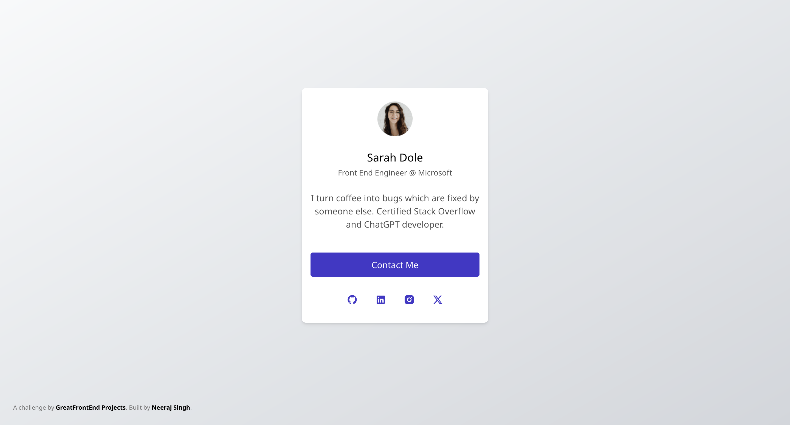

## Description

Developed a simple profile card that includes a profile picture, name, title, links to social media profiles, and a call-to-action (CTA) button.

## Live Demo

- [Live Demo](https://profile-card869.netlify.app/)

## UI Snapshot

## Contributing

1. File an issue to notify about what you're working on (Optional, Mandatory only when working on big changes).
2. Fork the repo, develop, and make code changes.
3. Make sure that your commit messages clearly describe the changes.
4. Send a pull request.

## Issues

Want to submit an [issue](https://github.com/neerajsingh869/profile-card/issues) to this project?

## License

This project is licensed under the MIT License - see the [LICENSE](https://choosealicense.com/licenses/mit/) file for details.
